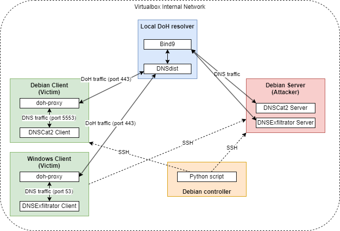

# Local_Malicious_DoH_Dataset_Automation

This implementation was realized for my master thesis on "Classification of malicious behaviors based on DNS-over-HTTPS traffic analysis"

## Goal

The various Python and Powershell codes and documentation enable malicious Command and Control (C&C) and Data Exfiltration behaviors to be created automatically in a local environment, using DNScat2 (C&C) and DNSExfiltrator (exfiltration) tools, over the DNS-over-HTTPS protocol using a DoH proxy.

### ⚠️ Disclaimer ⚠️
> 
> This repository and the tools are intended for educational and research purposes only. Use of the tools for illegal activities or unauthorized access is strictly prohibited. The authors and contributors are not responsible for any misuse or damages caused by the use of this software.

## Production environment configuration

In order to simulate malicious Command and Control (C&C) and Data Exfiltration behavior locally, it is necessary to configure the environment described in the respective tool folders, or to perform the complete configuration using the PDF file containing the general configuration and located in the `docs` folder.

A description of how to use the tools is also included in this folder.



## Main requirements

* Oracle VM VirtualBox
* Python 

## License

Local_Malicious_DoH_Dataset_Automation is released under the MIT license.

## Credits
Credits go to Mohammadreza MontazeriShatoori for the use, with his permission, of the backbone of his code from the paper:

"**Detection of DoH Tunnels using Time-series Classification of Encrypted Traffic**", Mohammadreza MontazeriShatoori, Logan Davidson, Gurdip Kaur and Arash Habibi Lashkari, The 5th Cyber Science and Technology Congress (2020) (CyberSciTech 2020), Vancouver, Canada, August 2020
```
@INPROCEEDINGS{9251211,
  author={MontazeriShatoori, Mohammadreza and Davidson, Logan and Kaur, Gurdip and Habibi Lashkari, Arash},
  booktitle={2020 IEEE Intl Conf on Dependable, Autonomic and Secure Computing, Intl Conf on Pervasive Intelligence and Computing, Intl Conf on Cloud and Big Data Computing, Intl Conf on Cyber Science and Technology Congress (DASC/PiCom/CBDCom/CyberSciTech)}, 
  title={Detection of DoH Tunnels using Time-series Classification of Encrypted Traffic}, 
  year={2020},
  volume={},
  number={},
  pages={63-70},
  doi={10.1109/DASC-PICom-CBDCom-CyberSciTech49142.2020.00026}}
  ```